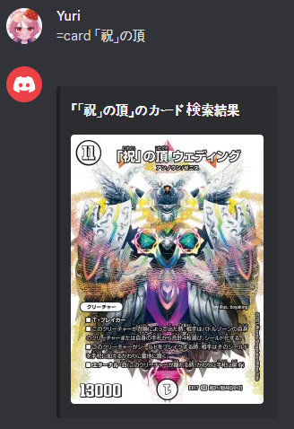

<h1 align="center">Discord Duel Masters Card Search Bot</h1>
<div align="center"></div>

Using table game applications on Steam or mobile devices along with Discord, you can enjoy Duel Masters anytime, anywhere, even with friends who are far away.
The Duel Masters card search bot allows you to **easily search for Duel Masters cards and check their information within Discord through simple command inputs**, even during gameplay.

## Getting Start
### Prerequisites
This project was designed and implemented using `beautifulsoup4` for web parsing and `discord.py` for Discord bot invocation and response, so the following dependencies are required:
- beautifulsoup4 4.12.3
- discord.py 2.4.0
- requests 2.32.3

### Installation
1. Clone the repository:
```
git clone https://github.com/Yuri-0/solge_bot.git
cd solge_bot
```
2. Install required dependencies:
```
pip install -r requirements.txt
```

### Usage
1. Using an editor such as vim or nano, modify the `token` variable on line 11 of `card_search.py` with the your own Discord bot's token. </br>(The Discord bot token can be obtained by creating a bot through the Discord Developer Portal. Refer to the [official documentation](https://discordpy.readthedocs.io/en/stable/discord.html) for details.)
2. Run the `card_search.py` script using the Python runtime as follows:
```
python3 card_search.py
# Logged in as
# <bot user name>
# <bot user id>
# ------
```
3. Invite the Discord bot created in step 1 to any server and grant the bot permission to read and write messages in that server. </br>(Refer to the [official documentation](https://discordpy.readthedocs.io/en/stable/discord.html#inviting-your-bot) for methods on inviting Discord bots to servers and granting permissions.)
4. In the **chat window of a server and channel where the Discord bot can read and write messages**, call the bot using the command prefix as follows:
```
!card <search keyword>
```
**Command Body**

|Name|Type|Required| Description                                                                                                                                                                                                                          |
|:---:|:---:|:---:|:---|
|search keyword|string|Y| Search terms related to Duel Masters cards such as card names, Japanese pronunciations, text, etc. (i.e 「祝」の頂 ウェディング　かなあ). Due to using the card search function from the Japanese company Takaratomy, the search terms only correspond to Japanese. |
5. Check the card search results that the bot has replied with in the chat window.

|  |  |  |
|---|---|---|
| Example of a reply when a single card is found | Example of a reply when multiple cards are found | Example of a reply when no card is found |
